<p align="center">
  
</p>
<h1 align="center">Matka - Share Your Journey</h1>

Matka is a full-stack web application designed to help you document and share your life's journeys. Whether it's a grand adventure, a daily log, or a collection of memories, Matka provides a beautiful and intuitive platform to create posts with rich media, location data, and share them with the world or keep them private.

## 🚀 Overview

Matka offers a seamless experience across devices, allowing you to capture and share your moments effortlessly.

### User Interface
Experience Matka's intuitive design on any screen.

| Desktop UI | Mobile UI |
| :---------------------------------: | :---------------------------------: |
| 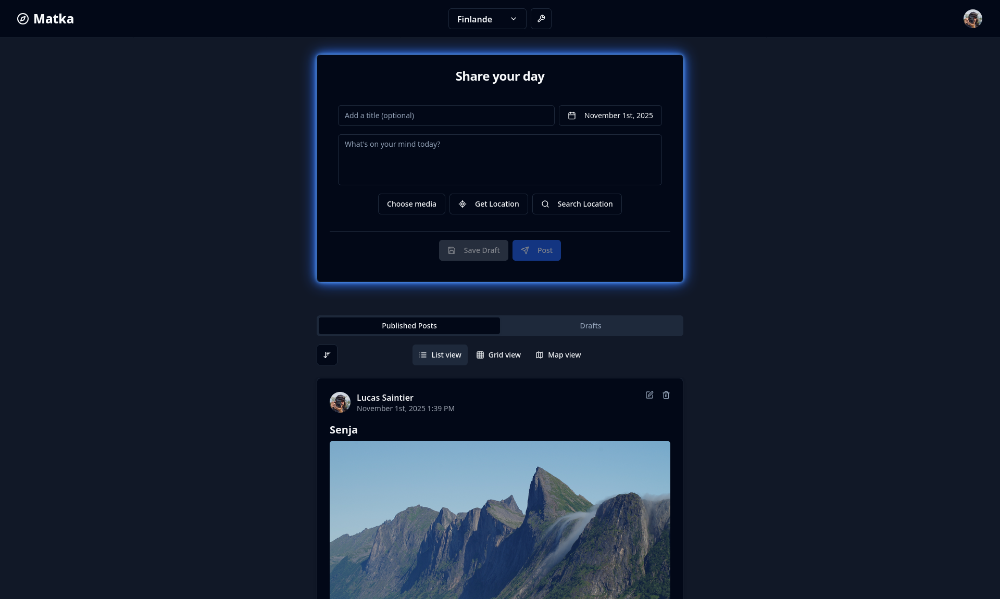 | 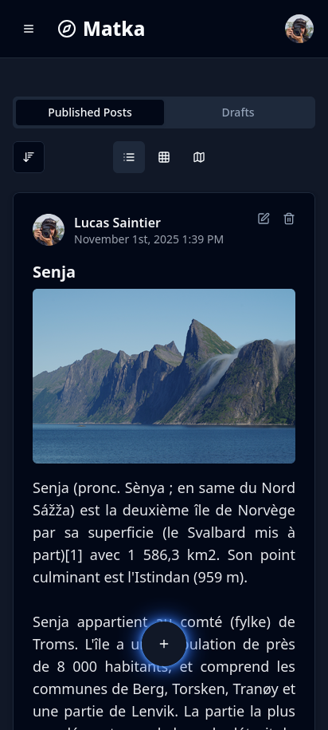 |

### Major Features
*   **Secure User Accounts:** Register as an admin, log in, and manage your profile.
*   **Organized Journeys:** Create, manage, and share your travel logs or daily diaries.
*   **Rich Post Creation:** Add text, images, videos, and location data to your posts.
*   **Diverse Viewing Modes:** Explore posts in list, grid, or interactive map views.
*   **Admin Controls:** A dedicated dashboard for user and journey management.

## ✨ Features

### 🔐 User Authentication & Management
Matka ensures secure access with a robust authentication system.
-   **Admin Registration:** The very first user to register automatically becomes the administrator, setting up the foundation for your application.
-   **Login/Logout:** Securely log in and out of your account.
-   **User Profiles:** Manage your personal information, including name, surname, profile picture, and preferred language.

| :---------------------------------: | :---------------------------------: |
|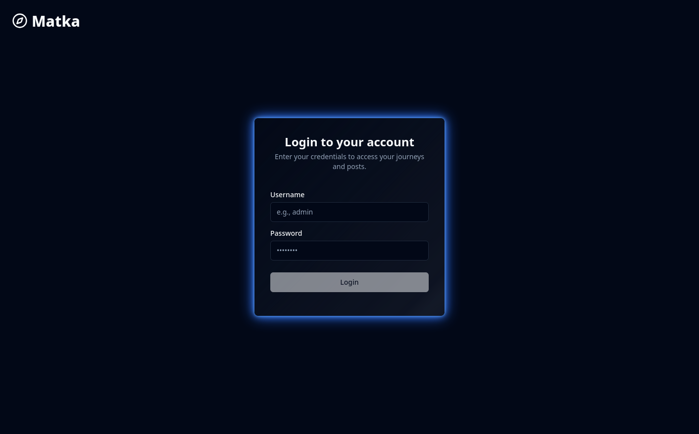 | 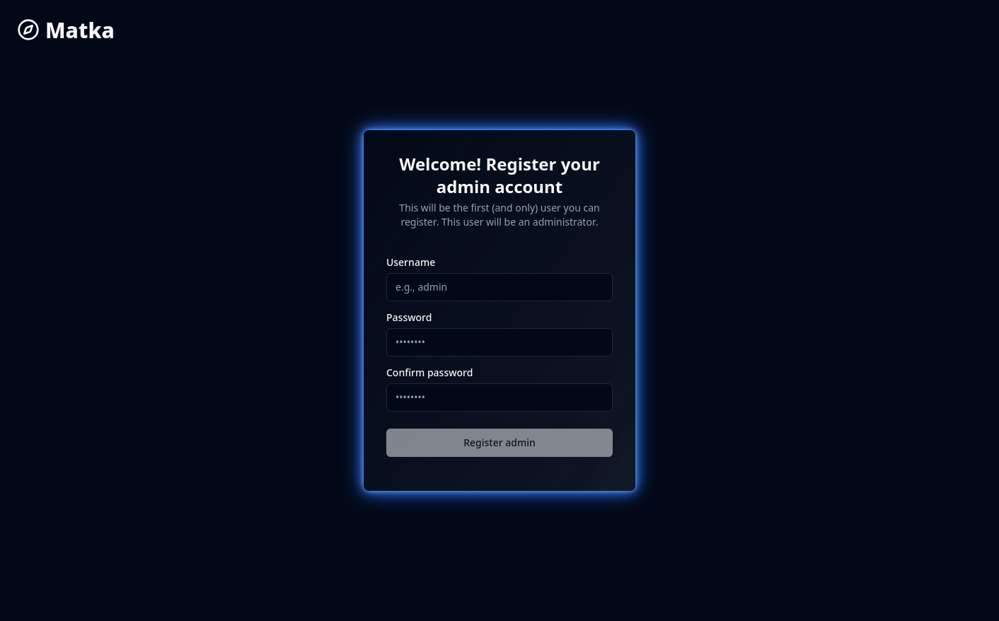 |

### 🗺️ Journey Creation & Management
Organize your posts into meaningful journeys.
-   **Create Journeys:** Easily create new journeys, each serving as a collection of your experiences.
-   **Manage Journey Details:** Rename your journeys and control their visibility.
-   **Public/Private Journeys:** Decide whether your journey is public for anyone to view or private for your eyes only.
-   **Passphrase Protection:** For public journeys, add an optional passphrase for an extra layer of privacy.
-   **Collaborator Management:** Invite other users to collaborate on your journeys, granting them specific permissions (read, publish, modify, delete posts).
-   **Draft Management:** Save your work for later with the draft section. Your redacted post are saved automatically every minute

| :---------------------------------: | :---------------------------------: |
|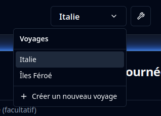 |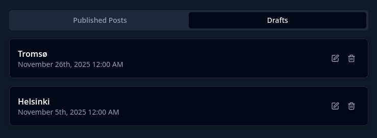|
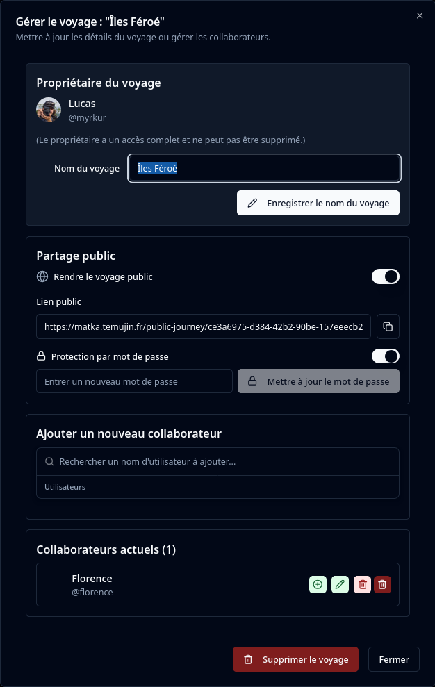

### ✍️ Rich Post Creation
Document your experiences with detailed posts.
-   **Text & Title:** Add descriptive titles and messages to your posts.
-   **Media Uploads:** Include images and videos to bring your stories to life.
-   **Location Tagging:** Pinpoint the exact location of your posts using geolocation or a search-based map.
-   **Drafts:** Save your work as drafts and publish them when ready.
-   **Post Date Selection:** Set a specific date for your posts, allowing for retrospective journaling.
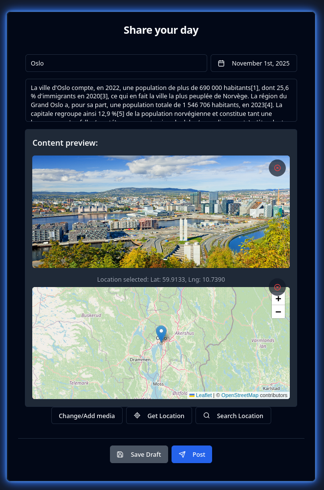

### 👁️ Diverse Post Viewing Options
Explore your journeys in multiple engaging ways.
-   **List View:** A chronological feed of your posts, ideal for detailed reading.
-   **Grid View:** A visually rich grid layout, perfect for browsing media-heavy posts.
-   **Map View:** See all your location-tagged posts on an interactive map, offering a geographical perspective of your journey.
-   **Post Detail Dialog:** Click on any post to open a detailed view with full media, message, and location information.

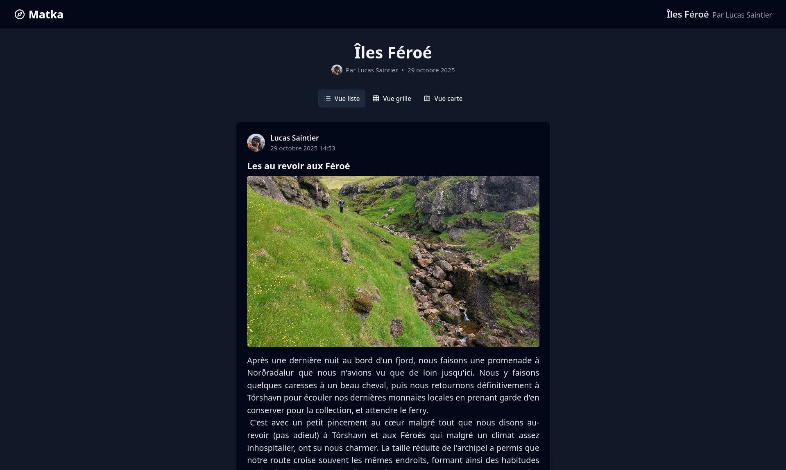
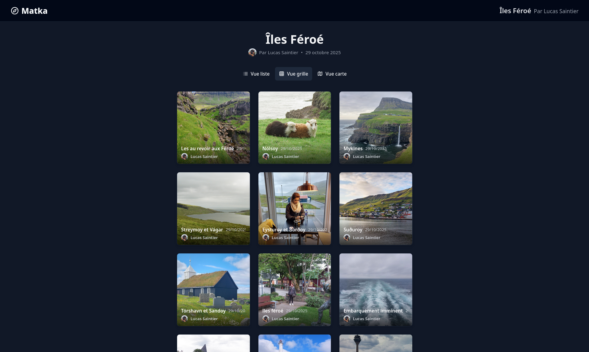


### ⚙️ User Settings & Preferences
Personalize your Matka experience.
-   **Profile Picture Cropper:** Upload and crop your profile picture directly within the app.
-   **Language Selection:** Choose your preferred language for the application interface.
-   **Theme Toggle:** Switch between light, dark, and system themes to suit your visual preference.

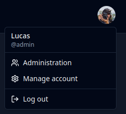
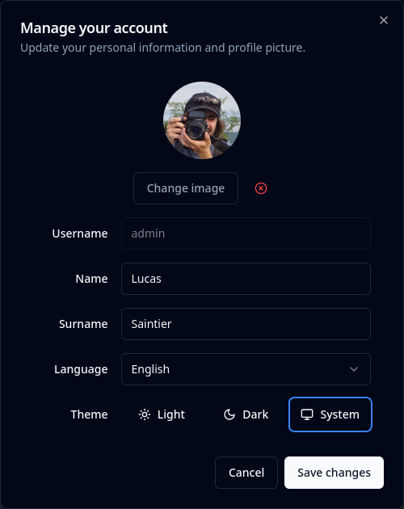

### 👑 Admin Dashboard
For administrators, a dedicated dashboard to manage the application.
-   **User Management:** View, create, reset passwords for, and delete users.
-   **Journey Oversight:** View and manage all journeys created within the application.

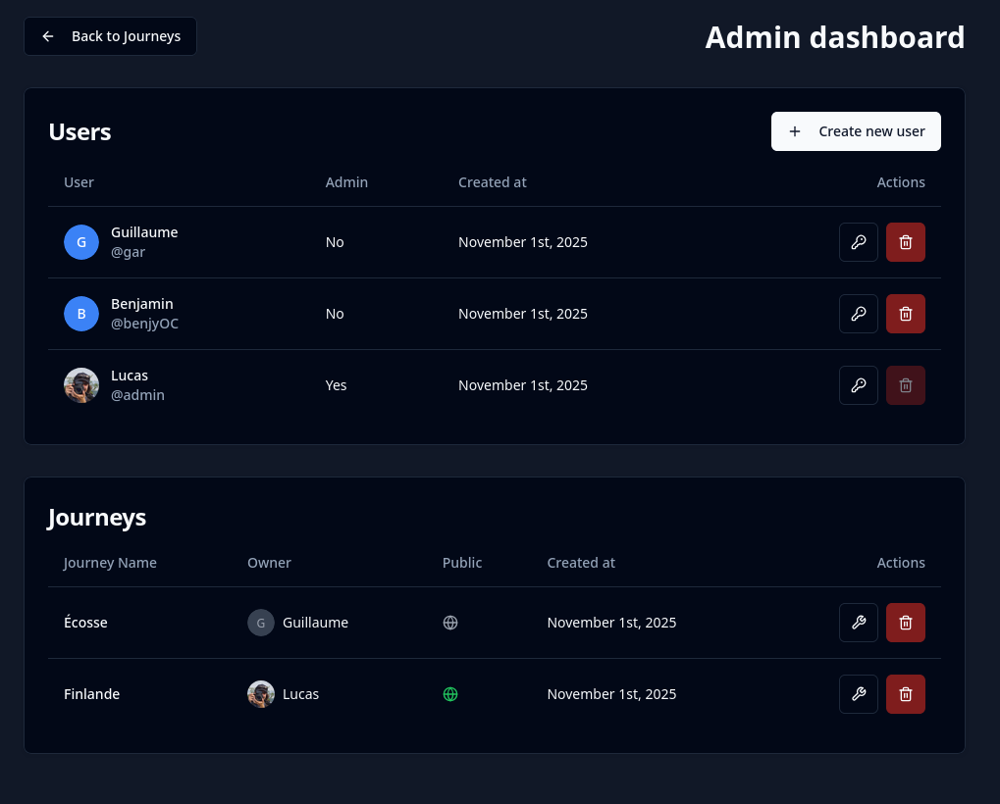

### 📱 Responsive Design
Matka is designed to look great and function seamlessly across all devices, from desktops to mobile phones.

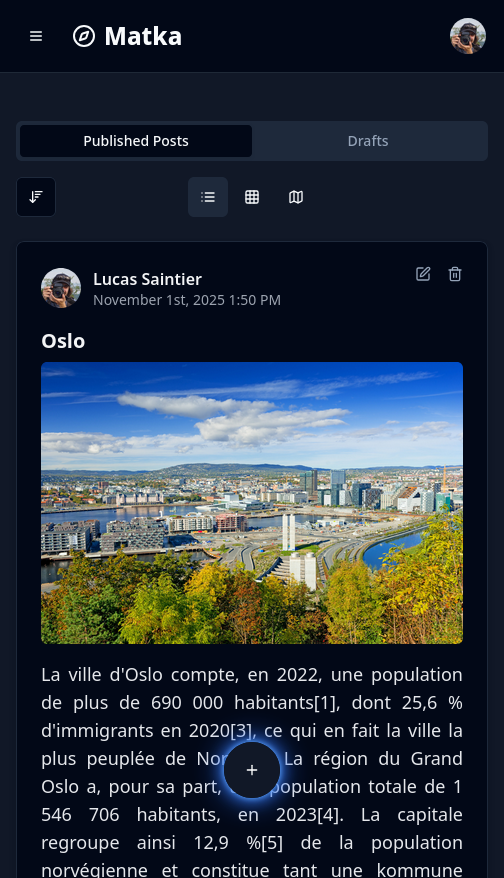

## 🛠️ Technical Stack

-   **Frontend:** React, TypeScript, React Router
-   **Styling:** Tailwind CSS, shadcn/ui
-   **Backend:** Fastify, TypeScript, PostgreSQL
-   **Database:** PostgreSQL
-   **Deployment:** Docker, Docker Compose
-   **Internationalization:** i18next
-   **Mapping:** Leaflet

## 🚀 Getting Started

This application is a full-stack React and Fastify project.

### Running with Docker Compose (Published Image)

To get the application up and running quickly using pre-built Docker images:

1.  **Ensure Docker is installed:** Make sure you have Docker and Docker Compose installed on your system.
2.  **Clone the repository:**
    ```bash
    git clone <your-repo-url>
    cd <your-repo-name>
    ```
3.  **Start the services:**
    ```bash
    docker compose up -d
    ```
    This command will pull the necessary images (PostgreSQL and the application) and start the services in detached mode.
4.  **Access the application:** Once the services are up, you can access the frontend in your browser at `http://localhost:8080`.

### Building and Running Locally with Docker Compose

If you want to build the Docker image for the application locally (e.g., for development or custom changes):

1.  **Ensure Docker and Node.js are installed:** Make sure you have Docker and Node.js (LTS version recommended) installed on your system.
2.  **Clone the repository:**
    ```bash
    git clone <your-repo-url>
    cd <your-repo-name>
    ```
3.  **Build the application image:**
    ```bash
    docker compose build
    ```
    This command will build the `app` service image using the `Dockerfile` in the root directory.
4.  **Start the services:**
    ```bash
    docker compose up -d
    ```
    This will start the PostgreSQL database and your locally built application image.
5.  **Access the application:** Once the services are up, you can access the frontend in your browser at `http://localhost:8080`.

### Important Notes:

*   **Environment Variables:** The `docker-compose.yml` file sets up necessary environment variables like `DATABASE_URL` and `JWT_SECRET`. For local development, you might also use a `.env` file (which is ignored by Git) for additional local-specific configurations.
*   **Data Persistence:** The `db_data` volume ensures that your PostgreSQL data persists even if you stop or remove the containers.
*   **Uploads:** The `./backend/uploads` directory is mounted into the container to persist any uploaded media files.
